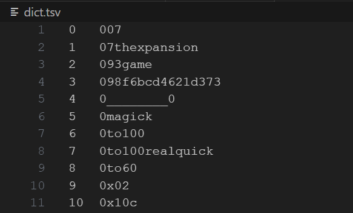
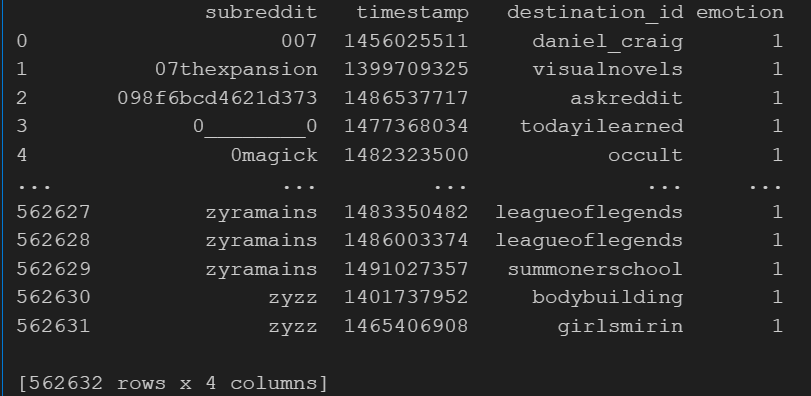
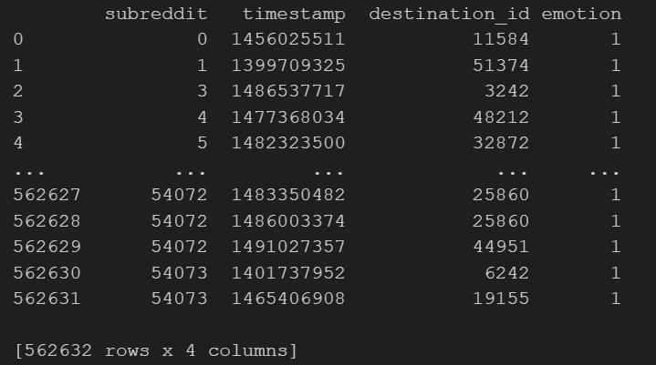
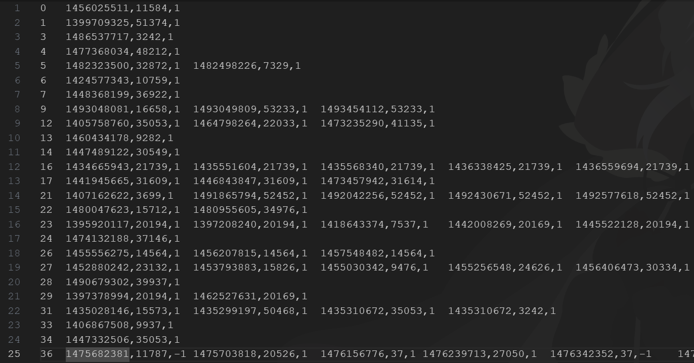
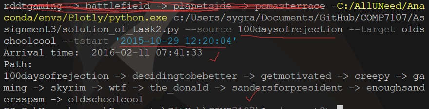
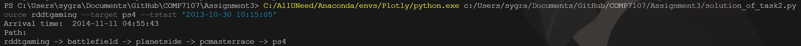
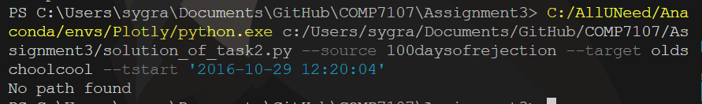
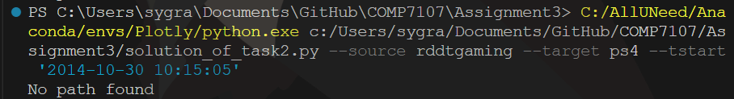

# Report for the Assignment3 of COMP7107

Zheming Kang, 3036195746

Environment: pandas: 2.0.3; python 3.8.18; pytz 2023.3

## Task 1: Graph preprocessing


The solution of task 1 is "solution_of_task1.ipynb". Put the soc-redditHyperlinks-title.tsv file and the ipynb file in the same address, then run the cells in task 1. You'll see the dict.tsv and the graph.tsv files are generated.

### Task 1.1

In task 1.1, we are required to generate dict.tsv file. First, we read the file with read_csv function in pandas. We use '\t' to split the content in the original file. Then, we get the union of the two sets: unique source subreddit and unique target subreddit. By this operation, we get a set of distinct names of subreddit. Then, we sort them and assign an id. Finally, we store back to the dict.tsv file.

```python
filename = "soc-redditHyperlinks-title.tsv"
df = pd.read_csv(filename, sep='\t')

subreddits = set(df['SOURCE_SUBREDDIT'].unique()).union(set(df['TARGET_SUBREDDIT'].unique()))
subreddits = list(subreddits)
subreddits.sort()
# print(subreddits)
# convert the subreddits to a df, with a unique integer identifier
subreddit_df = pd.DataFrame(subreddits, columns=['subreddit'])
subreddit_df['id'] = subreddit_df.index
subreddit_df = subreddit_df[['id', 'subreddit']]
subreddit_df.to_csv('dict.tsv', sep='\t', index=False, header=False)

```

The snapshot of dict.tsv is:

 

### Task 1.2

In task 1.2, we are required to generate a graph.tsv file, which is actually an adjacency lists. 

First, we read the file and use the group by function of pandas. Then, for each group, we get the outgoing edges and switch the time data to the timestamp. After process the group, we need to convert the origin time zone to hk zone. Since the difference between the origin time zone and the hk zone is 8 hours, we calculate the 8*3600 to get the seconds and convert the timestamp. Finally, we convert the timestamp number to the string values.

```python
df = pd.read_csv(filename, sep='\t')
graph_df = pd.DataFrame(columns=['subreddit', 'timestamp', 'destination_id', 'emotion'])


def process_group(group):
    outgoing_edges = group[['TIMESTAMP', 'TARGET_SUBREDDIT', 'LINK_SENTIMENT']]
    outgoing_edges = outgoing_edges.drop_duplicates()
    outgoing_edges.columns = ['timestamp', 'destination_id', 'emotion']
  
    outgoing_edges['timestamp'] = outgoing_edges['timestamp'].apply(lambda x: pd.Timestamp(x).timestamp())
    outgoing_edges.insert(0, 'subreddit', group.name)
    return outgoing_edges

grouped = df.groupby('SOURCE_SUBREDDIT')
graph_df = pd.concat([graph_df, grouped.apply(process_group)], ignore_index=True)

# Convert to hk zone
graph_df['timestamp'] = graph_df['timestamp'] - 28800
# Convert to string
graph_df['timestamp'] = graph_df['timestamp'].apply(lambda x: str(int(x)))

print(graph_df)
```

The snapshot is below: we can see the subreddit and destination id are names, not id. So we need one more step to convert the names to the id. 



The idea here is to use a dictionary, or we say, a hashmap. By creating a hashmap in our memory, we could find the id in O(1) time.

```python
# Read the dict.tsv file and create a dictionary mapping subreddit names to subreddit ids
dict_df = pd.read_csv('dict.tsv', sep='\t', header=None, names=['id', 'subreddit'])
subreddit_dict = dict(zip(dict_df['subreddit'], dict_df['id']))

# Convert the data type of subreddit and destination_id columns to match the data type of the keys in subreddit_dict
graph_df['subreddit'] = graph_df['subreddit'].astype(str)
graph_df['destination_id'] = graph_df['destination_id'].astype(str)

# Replace the subreddit names with the subreddit ids, and fill NaN values with -1
graph_df['subreddit'] = graph_df['subreddit'].map(subreddit_dict).fillna(-1)
graph_df['destination_id'] = graph_df['destination_id'].map(subreddit_dict).fillna(-1)

print(graph_df)

```

The snapshot after this step is below, everything looks good:



Finally, we need to write these data into the graph.tsv file. First we need to create the adjacency list in our main memory. Then, for each item in the list, we write in one line with the required format.

```python
def create_adjacency_list(graph_df, output_file):
    adjacency_list = {}

    # Create adjacency list
    for _, row in graph_df.iterrows():
        subreddit = str(row['subreddit'])
        destination_id = str(row['destination_id'])
        timestamp = str(row['timestamp'])
        emotion = str(row['emotion'])
  
        if subreddit not in adjacency_list:
            adjacency_list[subreddit] = []
  
        adjacency_list[subreddit].append(( timestamp, destination_id,emotion))
  
    # write into the files
    with open(output_file, 'w') as f:
        for subreddit, edges in adjacency_list.items():
            destinations = '\t'.join(f"{timestamp},{dest_id},{emotion}" for timestamp, dest_id, emotion in edges)
            line = f"{subreddit}\t{destinations}\n"
            f.write(line)

create_adjacency_list(graph_df, 'graph.tsv')
```

The snapshot below is the graph.tsv file. We are all done.



## Task 2: time-dependent shortest path search – earliest arrival path

The solution of task 2 is solution_of_task2.py file. You could run the file with the following formats:

```
Your_environment_of_python/python.exe This_py_file_address/solution_of_task2.py --source rddtgaming --target ps4 --tstart '2013-10-30 10:15:05'
```

More specifically, on my laptop, the command line could be like this:

```
C:/AllUNeed/Anaconda/envs/Plotly/python.exe c:/Users/sygra/Documents/GitHub/COMP7107/Assignment3/solution_of_task2.py --source rddtgaming --target ps4 --tstart '2013-10-30 10:15:05'
```

You can use the --source to set the source subreddit and the --target to set the target subreddit. The --tstart is the start time. Also, you could use the --filename to set the address of graph.tsv file, or you could put the graph.tsv file and the py file in the same folder without setting the --filename parameter.

Firstly, we set the parameters and get the parameters from the command line:

```python
    parser = argparse.ArgumentParser(description='Dijkstra Algorithm')

    # Add command line arguments
    parser.add_argument('--filename', type=str, default='graph.tsv', help='Graph data filename')
    parser.add_argument('--source', type=str, default='source_subreddit', help='Source subreddit name')
    parser.add_argument('--target', type=str, default='target_subreddit', help='Target subreddit name')
    parser.add_argument('--tstart', type=str, default='2024-04-09 10:00:00', help='Start timestamp')

    # Parse the arguments
    args = parser.parse_args()

    # Get the arguments
    filename = args.filename
    source = args.source
    target = args.target
    tstart_str = args.tstart
    tstart = datetime.datetime.strptime(tstart_str, '%Y-%m-%d %H:%M:%S')
    tstart = int(tstart.timestamp())
```

Here we have 4 arguments which are discussed before. When we get the tstart argument, we convert it to timestamp. Since the input arguments of subreddit are names, we need to create a dictionary to find the id of the subreddit.

```python
    dictionary = {}
    with open('dict.tsv', 'r') as file:
        for line in file:
            line = line.strip().split('\t')
            key = line[0]
            value = line[1]
            dictionary[value] = key
    # print(dictionary)
    source = dictionary[source]
    target = dictionary[target]
```

Since only the positive subreddit is useful, we only keep those edges whose emotions are 1. Then, we insert them into the adjacency list.

```python
    adjacency_list = {}

    with open(filename, 'r') as file:
        for line in file:
            line = line.strip().split('\t')
            source_id = line[0]
            triples = line[1:]
  
            if source_id not in adjacency_list:
                adjacency_list[source_id] = []
  
            for triple in triples:
                timestamp, target_id, emotion = triple.split(',')
                timestamp = int(timestamp)
                if emotion == '1':
                    adjacency_list[source_id].append((timestamp, target_id))
```

Then, we give adjacency_list, source, target, tstart to our dijkstra function, and the dijkstra function will return the path and distance. At the beginning of the dijkstra, we need to set the distances and previous node to inf and None. Then, the distance of source is tstart. After that, we set a priority queue and insert the tstart and source into the pq.

```python
def dijkstra(adjacency_list, source, target, tstart):
    # Initialize the distances and previous dictionary
    distances = {node: sys.maxsize for node in adjacency_list}
    previous = {node: None for node in adjacency_list}
    distances[source] = tstart
    # Create a priority queue, the first element is the source with distance tstart
    priority_queue = [(tstart, source)]
```

Then, we pop an element in the pq while the pq is not empty. We get the distance, and node id. If the node is target, we find the goal so we break the loop. 

```python
    while priority_queue:
        # First, we pop the node with the smallest distance
        current_distance, current_node = heapq.heappop(priority_queue)

        # If the current node is the target, we break the loop
        if current_node == target:
            break
```

Then, for the neighbor of the current node, if there is no outgoing path and the neighbor is not the target, we skip it. Otherwise, we get the timestamp and the node id of the neighbor. We shall check if the neighbor timestamp is not smaller than the current timestamp. If smaller, we continue. If not smaller, we check if could we update the distance and update the distance and privious node (or not). 

```python
        # Visit all the neighbors of the current node
        for neighbor in adjacency_list[current_node]:
            # If the neihgbor do not have any path to the target, and the neighbor is not the target, we skip it
            if (neighbor[1] not in adjacency_list) and (neighbor[1] != target):
                continue
            # Here, the neighbor has a path to outside, we get the timestamp and the node
            neighbor_timestamp, neighbor_node = neighbor

            # If the timestamp is not smaller than the current distance(current timestamp), we go one step to see if we can update a new distance
            if neighbor_timestamp >= current_distance:
                new_distance = neighbor_timestamp

                # If the new distance is smaller than the distance to the neighbor, we update the distance and previous
                if new_distance < distances[neighbor_node]:
                    distances[neighbor_node] = new_distance
                    previous[neighbor_node] = current_node
                    heapq.heappush(priority_queue, (new_distance, neighbor_node))
```

After the loop, if we find the target, we search back and put them into an array. Finally we reverse the array and return.

```python
    # If we find the path, we reconstruct the path
    path = []

    # If the distance to the target is valid:
    if distances[target] != sys.maxsize:
        # Trace back the path with the link of previous
        node = target
        while node is not None:
            path.append(node)
            node = previous[node]
        # Reverse the path
        path.reverse()

    return path, distances[target]
```

After the dijkstra, we also create a dictionary to convert the subreddit id to name.

```python
    dictionary = {}

    with open('dict.tsv', 'r') as file:
        for line in file:
            line = line.strip().split('\t')
            key = line[0]
            value = line[1]
            dictionary[key] = value
```

Then, if we have a valid path, we output, otherwise we output no path found.

```python
path, distance = result
    if len(path) == 0:
        print("No path found")
    else:  
        # Change the distance to a datetime object
        distance = datetime.datetime.fromtimestamp(distance)
        print("Arrival time: ", distance)
        print("Path: ")
        for i in range(len(path)):
            print(dictionary[path[i]], end='')
            if i != len(path) - 1:
                print(' -> ', end='')
```

The results are below:








